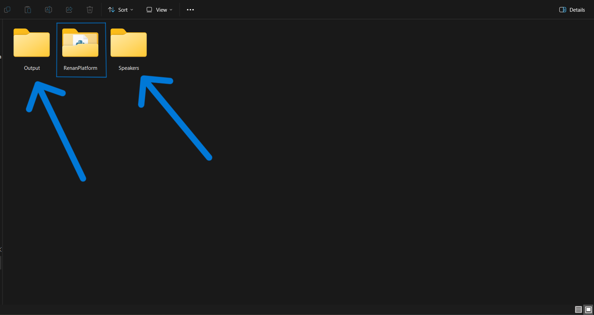
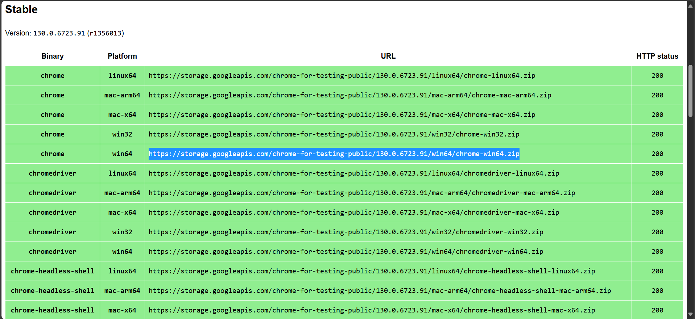
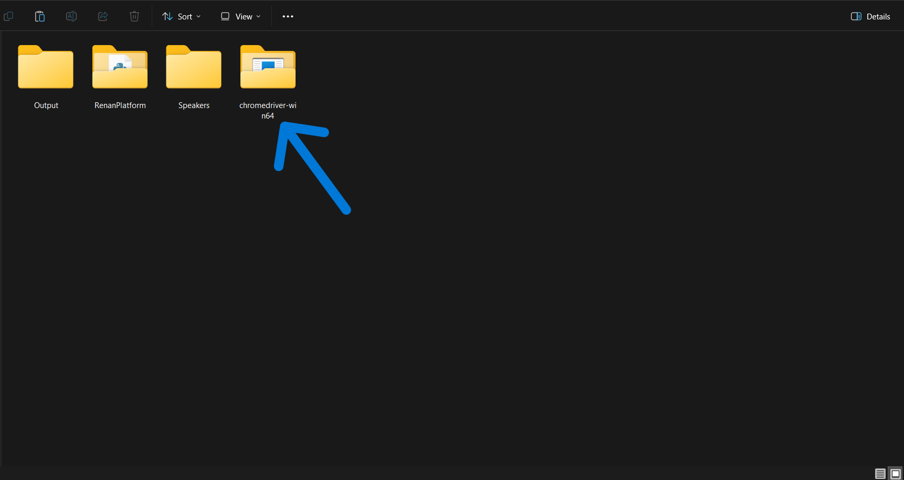
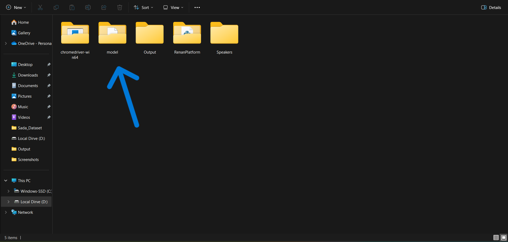

<div align="center">

## 

**Website to Try Renan Model**

</div>

## Team Members
- [Sultan AlBayyat - سلطان البيات](https://www.linkedin.com/in/sultan-albayyat/)
- [Fatimah Aljishi - فاطمة الجشي](https://www.linkedin.com/in/fatimah-aljishi-103927291/)
- [Hasan Alzayer - حسن الزاير](https://www.linkedin.com/in/hasan-alzayer/)
- [Abdullah Al-Tamh - عبدالله الطعمة](https://www.linkedin.com/in/abdullah-al-tamh-643851281/)
- [Sarah Alshaikhmohammed - ساره آل شيخ محمد](https://www.linkedin.com/in/sarah-alshaikhmohammed-ab20a9252/)


## Prequests

- `3.9.x <= Python < 3.12`
- `CUDA >= 11.8`

## Installation
Follow these steps for installation:

1. Ensure that `CUDA` is installed
2. Clone the repository: 

```bash
git clone https://github.com/MrZeroX1/RenanPlatform.git
```

3. Navigate into the directory: 

``` bash
cd RenanPlatform
```

4. Create a virtual environment: 
    - On Terminal 
    ``` bash
    python -m venv renanplatform
    ```
    - On Anaconda 
    ``` bash
    conda create --name renanplatform python=3.11.9
    ```
5. Activate the virtual environment:
   - On Anaconda : 
   ```bash
   conda activate renanplatform
   ```
   - On Windows use : 
   ```bash
   renanplatform\scripts\activate
   ```
   - On linux use: 
   ```bash
   source renanplatform\bin\activate
   ```
   
6. Ensure that you install `CUDA Toolkit 12.4` from their official site [CUDA 12.4](https://developer.nvidia.com/cuda-12-4-0-download-archive) (I choose 12.4 not 12.5 because the PyTorch only support 12.4 for now)

7. Install PyTorch and torchaudio with pip command :

   ```bash
   pip3 install torch torchvision torchaudio --index-url https://download.pytorch.org/whl/cu124
   ```

8. Install all dependencies from requirements.txt :

    ```bash
    pip install -r requirements.txt
    ```
## During the implementation
Before you start running the code, you need to do these to make that website run perfectly

1. Create `Speaker` and `Output` folders outside the project folder

    <div align="center">

    ## 

    </div>

2. You need to download [chromedriver](https://googlechromelabs.github.io/chrome-for-testing/#stable) **NOT chrome, chromedriver** by just copy and past the URL in the web browser and unzip it

   <div align="center">

    
    ## 
    ## 

    </div>
4. You need to download the model from the One Drive and place it with the rest of the files

      <div align="center">
    
    ## 

    </div>
The README File Under Construction... 🚧 
